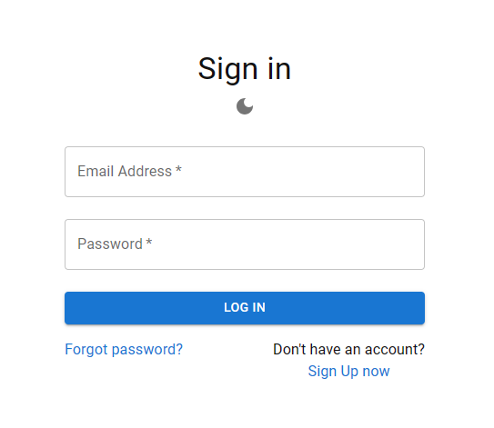
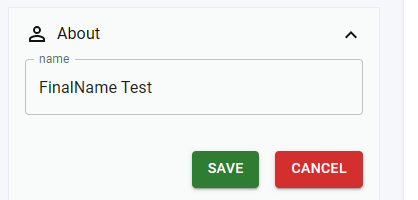
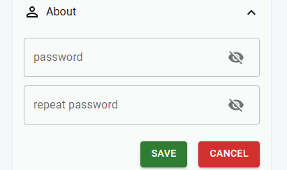

# Chat App

## Description

Chat App is a real-time chat application that allows users to seamlessly communicate with each other. It provides essential features such as user authentication, messaging, searching for users, viewing older conversations, and managing user profiles.

The application is built using Next.js for the frontend, Firebase for the backend and hosting, and Material-UI (MUI) for styling.

## Table of Contents
- [Getting Started](#getting-started)
- [Usage](#usage)
- [Features](#features)
- [License](#license)
- [Acknowledgments](#acknowledgments)
## Getting Started

To get started with Chat App, follow these steps:

1. Clone the GitHub repository:

    ```bash
    git clone https://github.com/your-username/chat-app.git
    ```

2. Change into the project directory:

    ```bash
    cd chat-app
    ```

3. Install dependencies:

    ```bash
    npm install
    ```

4. Start the development server:

    ```bash
    npm run dev
    ```

    Or, if you prefer to build and run the production version:

    ```bash
    npm run build
    npm start
    ```
5. run tests:
   ```bash
   npm test
   ```


## Usage

Chat App provides the following functionalities:

- **User Authentication:** Sign up and sign in securely to access the chat features.
- **Messaging:** Send and receive real-time messages with other users.
- **User Search:** Find other users to start conversations with.
- **Conversation History:** Search and view older conversations.
- **Profile Management:** View your profile, change your name, and update your password.

## Features

- Real-time messaging
- User authentication
- User search functionality
- Conversation history retrieval
- Profile management

## Screenshots








## License

This project is licensed under the [MIT License](LICENSE).

## Acknowledgments

- [Next.js](https://nextjs.org/)
- [Firebase](https://firebase.google.com/)
- [Material-UI](https://mui.com/)
